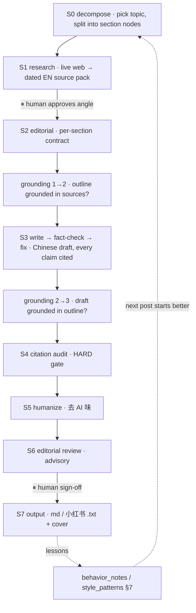

# aiblog — a verified multi-agent writer for Chinese AI-hot-topic posts

A Claude Code multi-agent system that writes a **Chinese** blog / 小红书 post about a
**latest AI hot topic**, one section at a time, proving each section against a written
contract **and** a machine-checkable fact/citation audit before moving on.

It is a deliberate port of a SAS→PySpark migration system's architecture standards to
prose: the leverage in both is a **machine-checkable correctness criterion**. SAS
migration gets one for free (per-node output equality). Prose does not — so this system
manufactures the closest analog: **every factual claim must trace to a dated source.**

> Output language is **Chinese**; the factual source boundary is **English** (primary AI
> sources — lab blogs, papers, release notes — are overwhelmingly English). The system is
> cross-lingual by design.

## Why it's different from a one-shot "AI blog writer"

Most LLM article generators are a linear pipeline ending in a soft self-score. This system
borrows three load-bearing ideas from a verified data-migration pipeline:

1. **A machine oracle, not a vibe check.** Correctness is decided by tools that exit 0/1,
   not by an LLM grading itself.
2. **Per-section contracts + gates.** The smallest verifiable unit is a section, not the
   whole article, so errors surface early.
3. **A self-improvement loop.** Every shipped piece that revealed a tell feeds a rule back
   into the repo, so the next post starts better.

## The quality funnel (where each check lives)

```
citation_audit.py     →  grounding_gate.py      →  editorial-reviewer  →  human gates
(machine: marker          (LLM judge: does each      (LLM judge: taste,     (angle @ S1,
 exists, fresh,           downstream claim trace     argument, AI-味)       sign-off @ S6)
 coverage)                to upstream — faithfulness)
```

Correctness stays in the **machine** layer on purpose: it sidesteps the LLM-as-judge
saturation trap (a judge can't reliably grade output stronger than itself). The two
machine oracles:

| Tool | Checks | Exit |
|---|---|---|
| `tools/citation_audit.py` | every claim has an `[Sn]` marker (no 裸论断), sources are dated + fresh, word-count / required-keyword / must-cite coverage, optional source-authority + `--banned-phrases`. CJK-aware. | 0 = PASS / 1 = FAIL |
| `tools/grounding_gate.py` | faithfulness — outline points trace to sources (`source_ids`), draft claims trace to outline (`outline_ids`). Fails closed on an empty verdict (`--allow-empty` to override). | 0 = PASS / 1 = FAIL |
| `tools/factcheck_gate.py` | the fact-checker's per-claim verdict (cited ≠ true); any non-`SUPPORTED` claim fails. Fails closed on an empty verdict. | 0 = PASS / 1 = FAIL |
| `tools/aesthetic_audit.py` | the **aesthetic track's** oracle — 破折号 / card length / banned phrases / 「」 closure / 0X-0N card numbering / overline / **quote verification**. No `[Sn]` (poetry has no claims). | 0 = PASS / 1 = FAIL |
| `tools/audit_article.py` | wrapper that audits every section contract and re-checks final structure, section headings/markers, preserved citations, and unioned coverage requirements. | 0 = PASS / 1 = FAIL |

## Two content tracks

The system is dual-track. The `track` field in `STATE.md` is first-class (set at S0) and
selects which gates run — the orchestrator routes on it, agents never infer it mid-run:

| Track | Runs | Skips | Oracle |
|---|---|---|---|
| **`factual_ai_news`** | research · contract · grounding · fact-check · citation audit · source authority | — | `citation_audit` + `grounding_gate` + `factcheck_gate` |
| **`aesthetic_lifestyle`** | editorial-lite · 3 writer variants + curate · humanizer · taste review | citation / grounding / fact-check (a category error on poetry) | `aesthetic_audit` (the fact oracle shrinks to just verifying a quoted film line) |

The aesthetic track is the second port of the `citation_audit` *idea*: keep the LLM judge
for what needs taste, and let a deterministic tool catch the hard rules (破折号, banned
翻译腔 phrases from `common/banned_phrases.json`, card numbering, quote verification) that
do not. Enter it with `/write-aesthetic-post <theme>`.

## Pipeline



The **orchestrator** (main Claude Code session) owns state and is the only coordinator;
sub-agents cannot spawn sub-agents. Agent specs live in `.claude/agents/`.

## Use it

Open this folder as a Claude Code project, then:

```
/new-article <slug>            # scaffold a per-article workspace
/write-article <topic>         # factual AI-news pipeline (stops at the angle + sign-off gates)
/write-aesthetic-post <theme>  # aesthetic track: 3 variant drafts → curate → aesthetic_audit
/status                        # print the pipeline state table
/write-section <k>             # re-run one section's write → fact-check → audit loop
/handoff                       # write a system handoff for the next architect
```

Smoke-test the oracles on the shipped synthetic example (no setup, no network):

```
python3 tools/citation_audit.py articles/article_demo/sections/sec1_draft.md \
  --source-pack articles/article_demo/source_pack.json \
  --contract articles/article_demo/contracts/sec1_contract.json --as-of 2026-06-09   # PASS
python3 tools/grounding_gate.py articles/article_demo/sections/grounding_2to3.json \
  --allowed-outline-ids 1 --allowed-source-ids S1,S2,S3                               # PASS
python3 tools/factcheck_gate.py tests/fixtures/factcheck/good.json                    # PASS
python3 tools/factcheck_gate.py tests/fixtures/factcheck/bad_misattributed.json       # FAIL
python3 tools/audit_article.py articles/article_demo --as-of 2026-06-09               # PASS
python3 tools/aesthetic_audit.py tests/fixtures/aesthetic/good_post.json              # PASS
python3 tools/aesthetic_audit.py tests/fixtures/aesthetic/bad_em_dash.json            # FAIL
```

Add `--source-authority` to score cited sources against `common/source_authority.json` —
a blacklisted/aggregator domain FAILs, a piece with no tier-1/2 anchor WARNs (FAILs under
`--strict`), an unranked domain WARNs. This closes the "green-dashboard trap": cited +
faithful is not enough if the source itself is a content farm.

```
python3 tools/citation_audit.py <draft.md> --source-pack <pack.json> \
  --source-authority common/source_authority.json --as-of <date>
```

Build the default 小红书 technical long-image package after `final.md` is verified:

```
python3 tools/xhs_image_post.py articles/article_<slug>/final.md \
  --out-dir articles/article_<slug>/assets/xhs \
  --meta articles/article_<slug>/xhs_meta.json --check-caption
```

This writes card HTML, PNG cards when Chrome is available, a paste-ready caption, and
`content_manifest.json` for the manual publish queue. The optional `xhs_meta.json` sidecar
supplies the hook `cover_title` + shortened `caption` (see
`common/behavior_notes/xiaohongshu-baokuan-paradigm.md`); `--check-caption` fails if the
caption uses a number absent from the verified body.

### Optional: S0 topic discovery via Apify

To scout what's fresh before picking an angle, pull dated AI headlines (each carries a
publish date + publisher). Needs `APIFY_API_KEY` in `.env` (see `.env.example`). This is a
**discovery aid, not a citation source** — the `url` is a Google News redirect, so S1 still
fetches the real primary source before anything is cited.

```
python3 tools/news_discover.py --query "AI agents" --max 20 --timeframe 7d \
  --out articles/article_<slug>/news_discovery.json
```

### Optional: a final Chinese polish via Gemini

After both oracles are green, an optional last pass sends the finished text through Gemini
for **fluency only** (never facts/citations). Copy `.env.example` to `.env` (gitignored)
and add `GEMINI_API_KEY`:

```
python3 tools/gemini_polish.py <final.txt> --out <polished.txt> --dry-run   # cost estimate
python3 tools/gemini_polish.py <final.txt> --out <polished.txt>             # send
```

A cost guard refuses any call estimated over $1 (a single post is ≈ $0.001).

## Repo layout

```
CLAUDE.md              project brain + rules
CONTEXT.md             domain glossary (node / source pack / the oracle / 裸论断 …)
RUNBOOK.md             step-by-step
.claude/
  orchestrator.md      main-session playbook + gates + failure-mode防范
  runtime.md           how to run things, where files go
  agents/              9 sub-agent specs (research, editorial, writer, fact-checker,
                       grounding-checker, citation-auditor, humanizer, editorial-reviewer, output)
  commands/            /write-article /write-aesthetic-post /new-article /status /write-section /handoff
common/
  style_patterns.md    voice + 去 AI 味 + the §7 hard-rule checklist (single source of truth)
  banned_phrases.json  machine-checkable 翻译腔/AI-味 blacklist (data form of style §3)
  source_authority.json domain tiers for --source-authority (tier-1/2 allowlist + blacklist)
  behavior_notes/      conditional knowledge the writing agents glob (incl. 小红书 + aesthetic track)
platforms/
  xiaohongshu/         default long-image post adapter
tools/
  citation_audit.py    oracle 1 — marker/freshness/coverage/source-authority/banned-phrases
  grounding_gate.py    oracle 2 — faithfulness (does downstream trace to upstream; fails closed)
  factcheck_gate.py    oracle 3 — fact-check verdict gate (cited ≠ true; fails closed)
  aesthetic_audit.py   oracle 4 — aesthetic-track gate (dash/length/banned/quote/numbering)
  status.py            aggregate per-stage section results into a section × stage matrix
  outline_ids.py       validate outline.json + emit its ids (generates --allowed-outline-ids)
  new_article.py       scaffold + validate a per-article workspace from _TEMPLATE
  audit_article.py     article-level wrapper; audits sections + the assembled --draft
                       (humanized.md at S5, final.md at S7) as a first-class artifact
  xhs_image_post.py    default Xiaohongshu long-image post package builder
  news_discover.py     S0 topic discovery — fresh dated AI headlines via Apify
  xhs_research.py      one-off 小红书 爆款 calibration for the paradigm note (Apify)
  apify_client.py      thin stdlib Apify REST client (run an actor, get dataset items)
  gen_image.py         AI background-image gen (Gemini/Nano Banana); --dry-run + manifest
  gemini_polish.py     optional final fluency pass
articles/
  _TEMPLATE/           per-article scaffold
  article_demo/        synthetic worked example (used by the smoke tests)
handoff/               system handoffs — each iteration recorded for the next architect
```

Real article workspaces (`articles/article_<slug>/`) are gitignored — this repo ships the
**system**, not generated posts.

## Contributing / dev setup

Enable the commit guard once per clone so a system change can't land without its iteration-log entry:

```
git config core.hooksPath .githooks
```

The `pre-commit` hook rejects a commit that touches system paths (`platforms/`, `tools/`,
`.claude/`, `.githooks/`, `.github/workflows/`, `common/behavior_notes/`,
`common/style_patterns.md`, `CLAUDE.md`) unless `handoff/ITERATION_LOG.md` is staged in the
same commit — the local counterpart to the CI "Every PR appends to the iteration log" check.
Pure doc/handoff/article commits pass freely. Intentional bypass: `git commit --no-verify`.

## Status

Runs end to end. Both oracles are tested green and correctly red on planted bugs. A real
worked example (a Cursor-mobile-app 小红书 post, grounded in 8 dated English sources) was
produced and published; its generated content stays local by design.

## License

[Apache License 2.0](LICENSE).
