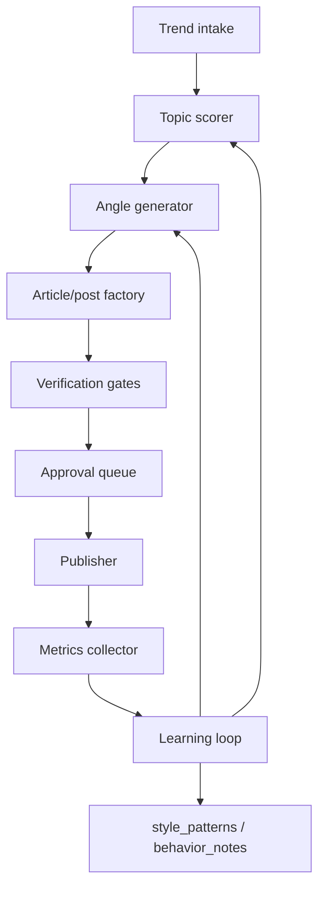

# Xiaohongshu growth system architecture

This note extends `aiblog` from a verified single-post writer into a repeatable content
lab for multiple topics, formats, and Xiaohongshu growth loops.

## Goal

Keep the current correctness spine for factual content, then add a growth layer around it:

1. Discover candidate topics.
2. Generate multiple angle/type variants.
3. Verify factual claims and platform fit.
4. Publish through a compliant channel.
5. Read performance signals.
6. Feed winning patterns back into topic selection, contracts, and style notes.

The system should optimize for learning velocity without letting the growth loop weaken
the factual gates.

## Non-negotiable boundaries

- Do not auto-publish through unofficial scraping/browser automation unless the account
  owner explicitly accepts the platform and account risk. Prefer an official creator API,
  partner API, or a human-in-the-loop publish queue.
- Keep a manual approval gate before any post that mentions people, companies, unreleased
  products, medical/financial advice, or contested claims.
- Never let performance metrics override sourcing rules. A high-click claim still needs a
  dated source.
- Store credentials outside the repo. The posting worker reads secrets from the deployment
  environment only.

## Proposed architecture



## Components

### 1. Trend intake

Collect candidate topics from several sources:

- AI primary sources: lab blogs, release notes, arXiv, GitHub releases, model leaderboards.
- Social signals: Xiaohongshu search suggestions, hot comments, Weibo/知乎/Bilibili trends.
- Product signals: Cursor, Claude, OpenAI, Gemini, developer-tool releases.
- User-owned backlog: topics the account owner wants to test.

Persist each candidate as structured data:

```json
{
  "topic_id": "cursor-mobile-2026-06-29",
  "title": "Cursor mobile launch",
  "source_urls": ["..."],
  "first_seen": "2026-06-30",
  "trend_signals": {
    "freshness_hours": 18,
    "source_authority": 0.9,
    "social_heat": 0.6,
    "audience_fit": 0.8
  }
}
```

### 2. Topic scorer

Rank topics with a simple transparent score first, not a black-box model:

`score = freshness * 0.30 + audience_fit * 0.25 + source_authority * 0.20 + novelty * 0.15 + production_fit * 0.10`

Add a penalty for:

- no primary source;
- no publishable visual asset;
- already saturated angle;
- claim likely to go stale within hours.

Store the score and reason. This makes later learning possible.

### 3. Angle and format generator

For each high-scoring topic, generate multiple contracts before writing:

- **Explainer:** "发生了什么 / 为什么重要 / 接下来看什么".
- **Opinion:** a sharper take, still source-backed.
- **Utility:** checklist, tutorial, prompt, workflow.
- **Comparison:** before/after, tool A vs tool B.
- **Personal note:** first-person learning or usage reflection.
- **Xiaohongshu long-image post (default):** cover + outline + 4-8 dense technical cards
  + source card. This is the primary output for technical posts.
- **Short Xiaohongshu text:** hook + body + CTA + hashtags, only when explicitly requested.

Each variant gets a `content_contract.json`:

```json
{
  "platform": "xiaohongshu",
  "format": "long_image_post",
  "target_reader": "Chinese AI-curious developer",
  "hook_type": "concrete dated fact",
  "word_min": 350,
  "word_max": 750,
  "must_cite": ["S1", "S2"],
  "required_keywords": ["Cursor", "移动端"],
  "success_hypothesis": "Mobile release posts work when framed as workflow change, not product news."
}
```

### 4. Post factory

Generalize the current article pipeline into content types:

- `article`: current 3-5 section pipeline.
- `xiaohongshu_long_image`: default Xiaohongshu output. Card-by-card image package; each
  card is a verifiable unit.
- `xiaohongshu_text`: one compact section plus title/hashtags, opt-in only.
- `thread`: one claim cluster per post in the thread.
- `newsletter`: longer article plus subject-line variants.

The current agents can stay. The first `format_adapter` is implemented as
`platforms/xiaohongshu/adapter.py`, exposed through:

```
python3 tools/xhs_image_post.py <final.md> --out-dir <article>/assets/xhs
```

It renders the verified final article into card HTML, PNGs when Chrome is available,
`post_xiaohongshu.txt`, and `content_manifest.json`.

### 5. Verification gates

Keep the gates, but adapt them by format:

- `citation_audit.py`: all factual sentences still need `[Sn]`.
- `grounding_gate.py`: each post/card must trace to the approved outline/angle.
- `fact-checker`: verifies claims against source quotes.
- `style/channel audit`: checks Xiaohongshu-specific rules from
  `common/behavior_notes/xiaohongshu-output-mode.md`.
- `policy audit`: flags risky claims, medical/financial advice, impersonation, or privacy
  exposure.

Add a `content_manifest.json` per output:

```json
{
  "content_id": "cursor-mobile-short-001",
  "topic_id": "cursor-mobile-2026-06-29",
  "format": "long_image_post",
  "variant": "workflow-change-angle",
  "source_pack": "source_pack.json",
  "contract": "contracts/post_contract.json",
  "audit_status": "pass",
  "approval_status": "pending"
}
```

### 6. Approval and publishing

Use a queue:

```text
drafted → verified → approved → scheduled → published → measured
```

Implementation options:

1. **Best:** official Xiaohongshu/creator API or approved third-party scheduling partner.
2. **Acceptable:** generate paste-ready text/assets and send a notification to the account
   owner for manual posting.
3. **Risky:** browser automation with Playwright. Only use if explicitly accepted; isolate
   the account, rate-limit heavily, keep manual review, and expect breakage.

Publisher should store:

- `platform_post_id`
- posted title/body/hashtags/assets hash
- scheduled and published timestamps
- account used
- any publish errors

### 7. Metrics collector

Collect metrics on a fixed cadence:

- impressions / views;
- likes;
- saves;
- comments;
- follows;
- profile visits;
- click-through if available;
- comment sentiment and recurring questions.

Normalize metrics by exposure:

- save rate = saves / views;
- follow rate = follows / views;
- comment rate = comments / views;
- early velocity = interactions in first 1-3 hours.

Define "viral" as a configurable threshold, not a vibe:

```json
{
  "viral_rules": {
    "min_views": 5000,
    "min_save_rate": 0.03,
    "min_like_rate": 0.05,
    "early_velocity_percentile": 0.8
  }
}
```

### 8. Learning loop

Do not let the system endlessly rewrite the same post. Iterate at the topic/angle level:

- If a post misses because the hook is weak, generate 3 new hooks from the same verified
  source pack.
- If saves are high but views are low, improve title/cover distribution.
- If views are high but saves are low, improve utility density.
- If comments ask the same question, create a follow-up post.
- If a topic has two failed variants, retire it unless new evidence appears.

Use a lightweight multi-armed bandit:

- arms = topic clusters, formats, hook types, cover styles;
- reward = weighted normalized score (`save_rate`, `follow_rate`, `comment_quality`);
- exploration budget = keep testing fresh topics instead of overfitting to yesterday's win.

Write back durable lessons:

- always-true writing rule → `common/style_patterns.md`;
- platform-specific pattern → `common/behavior_notes/xiaohongshu-output-mode.md`;
- growth data → `growth/experiments/*.jsonl` or a small database.

## Suggested repo evolution

Add these directories:

```text
growth/
  topics/                  # discovered topics and scores
  experiments/             # variants, hypotheses, metrics, decisions
  schedules/               # publish queue
  metrics/                 # raw and normalized platform metrics
platforms/
  xiaohongshu/
    adapter.py             # render default long-image post cards/assets
    publisher.py           # official API or approved queue integration
    metrics.py             # metrics ingestion
tools/
  score_topics.py
  xhs_image_post.py        # CLI wrapper for the default long-image post adapter
  create_variants.py
  audit_content.py
  schedule_publish.py
```

The first production milestone should not be full autoposting. Build in this order:

1. Topic scorer + variant contracts.
2. Xiaohongshu text/carousel output mode.
3. Verified publish queue with manual approval.
4. Metrics ingestion.
5. Learning loop that proposes the next topics/variants.
6. Compliant autopublish only after the queue is safe and the account owner approves the
   platform integration risk.

## Operating model

- Daily/continuous trend intake proposes candidates.
- The orchestrator selects a small batch under a fixed exploration budget.
- Each candidate produces 2-4 variants, not unlimited rewrites.
- Verified drafts enter the approval queue.
- Published posts feed metrics back into scoring.
- Weekly review promotes durable lessons into style/behavior notes.

The loop should optimize the next decision, not chase an infinite "make this viral" retry.
